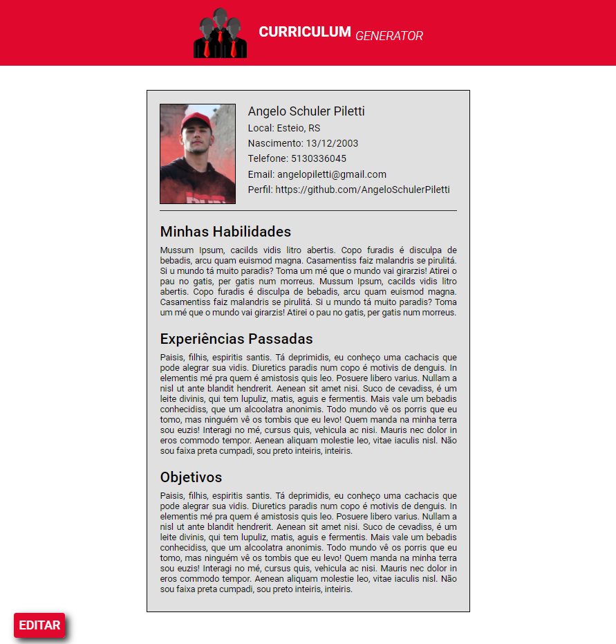
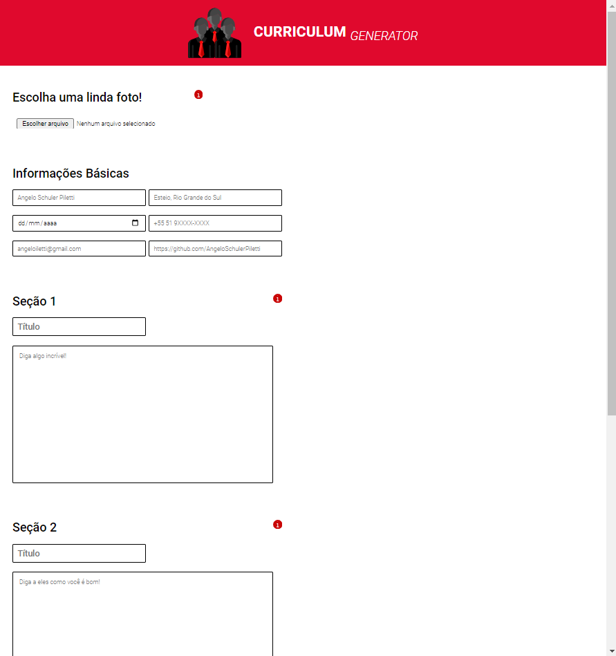
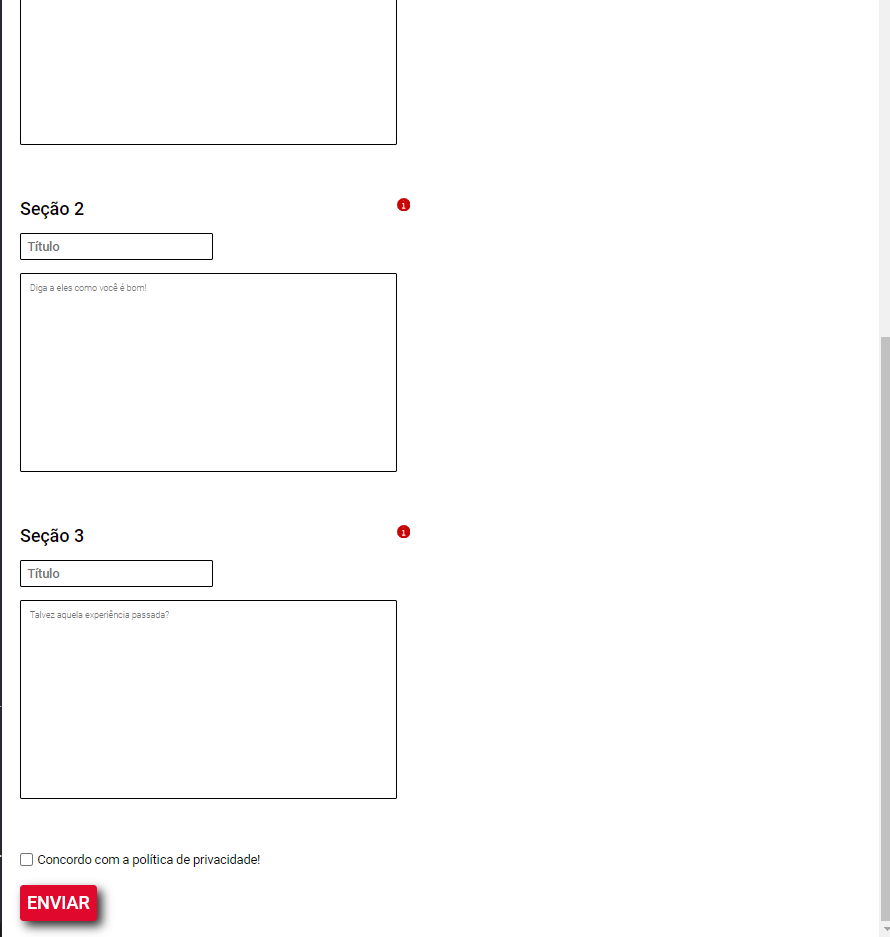

# Curriculum Generator

  

## What is It?
The **Curriculum Generator** is a very simple project where I look to test my knowledge about PHP and SASS. I will discourse more technically about this ahead.  
It doesn't have a **true utility**, because anyone can open a simple text editor and make the same thing. I made it more of a portfolio project than a serviceable web application.  
So, what it does: There are some inputs where the user inserts some data and submit it. The server process these using the * dataResolve.php * and if it is validated the server returns your curriculum with these informations.  

### My Personal Considerations
It took me **3 days** of work. At the first one, I focused on the directories structure, the web routes (considering a type of friendly URL), and how I would render the pages. 
Speaking specifically about the render of the pages, I searched to use less code as I could. Being a Laravel developer, I kind of tried to bring some **blade template mentalities** to this project. Of course, I didn't have the same ease, but I still got an elegant result. 
I could have finished it even earlier but the security would be less because the upload would not have any type of validation. 

#### About the beauty of the code...
I'm conscient that the code isn't clean or even easily understandable, but I haven't spent much time looking at it because It would take me a little more time. As I was focusing on fast code, I didn't give too much attention to this question.
 
 

 

## Technical Stuffs
Basically what happens in the application is: 
* The index.php requires the `layout.php`. The `layout.php` contains basically the head, header, body, and the main of the project. The codes that every page will use is inserted there;
* In the layout.php's main a function named `solveURL()` is called. It is at `Web.php`, from there, other 2 functions are called: `path()` and `route()`;
* The `path()` will go through other PHP archives where important vars will be set and a validation process will be done. After that, the `path()` will returns the path to which view must be rendered inside the main according to the result at the validation (`dataResolve.php`);
* Then the `route()` function will receives the value returned by the `path()` as a parameter;
* The magic is done, there is your **curriculum** or the **homepage** with some error messages;

#### SASS
Just for curiosity, because I have no way to show it in prints, the UX is not so developed, but I could make some pretty designs with the "*Info Messages*" when the mouse is over the Info icon. I also created a fixed div that appears when there is some error with the form validation. Making my own "`v-if=''`" like in the Vue.JS, for each error, a `
` is created with the message;
 
 

# Thank you for read it